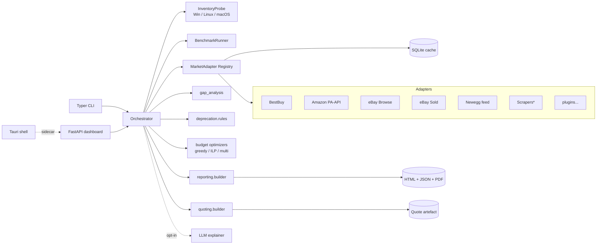
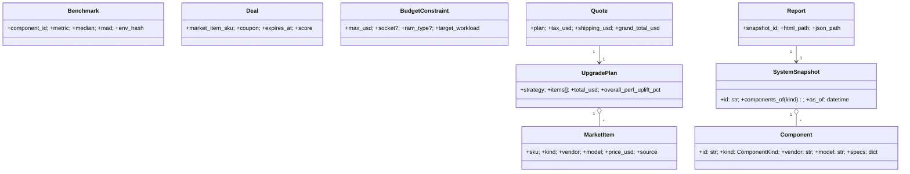

# PC Upgrade Advisor - Architecture

This document is the implementer-facing companion to `prompts/pc-upgrade-advisor-plan.md`.
It reflects what was **actually built** through Wave 4 + v1.x and marks deferred items.

> **Status (2026-04-17):** Waves 1-4 are implemented. v1.x extensions
> (multi-objective optimizer, LLM explainer, plugin SDK, used-market adapter)
> are shipped. The Tauri shell is scaffolded but not yet signed/distributed.

## 1. Goals (recap)

- Inventory a PC, measure/estimate its performance, and compare it against a
  live market snapshot.
- Produce a human-readable report (HTML+JSON today; PDF in Wave 2).
- Recommend an upgrade plan that maximizes performance within a user-provided
  USD budget while honouring compatibility constraints.
- Generate a shareable quote (itemized + tax/shipping estimates + deal links).
- US-first. Windows-first. Privacy by default (no telemetry, local data).

## 2. Tech stack (as shipped through Wave 4 + v1.x)

| Area                 | Choice                                               | Notes |
| -------------------- | ---------------------------------------------------- | ----- |
| Language             | Python 3.12 / 3.14                                   | `ruff` + `mypy --strict`. |
| Config               | `pydantic-settings`                                  | `PCA_*` env vars + `.env`. |
| Logging              | `structlog`                                          | JSON logs by default. |
| Domain models        | Pydantic v2 (frozen)                                 | JSON schemas exported via `core.models`. |
| Local storage        | SQLite (via SQLAlchemy 2.0)                          | Cache + catalog. Postgres optional for the web dashboard. |
| Hardware inventory   | `InventoryProbe` protocol: Windows / Linux / macOS   | `wmi` + `pynvml` (Win), `lshw`/`/proc` (Linux), `system_profiler`/`sysctl` (mac). |
| Benchmarking         | Built-in CPU worker + `fio`/`sysbench` shell-outs    | `BenchmarkRunner` does warm-up, median-of-N, CV check, env hash. |
| Market data          | `MarketAdapter` protocol + `AdapterRegistry`         | BestBuy, Amazon PA-API 5 (stub), eBay Browse, eBay Sold, Newegg affiliate feed. Scrapers behind a kill-switch. |
| Optimizers           | Greedy + `PuLP` ILP + multi-objective brute force    | Multi-objective returns a Pareto front over perf/power/noise. |
| Reporting            | Jinja2 HTML + JSON; `matplotlib` charts; WeasyPrint PDF | PDF ships optionally via the `reporting` extra (ADR 0008). |
| CLI                  | Typer + Rich                                         | 7 commands (`inventory`, `bench`, `report`, `market`, `recommend`, `quote`, `serve`). |
| Web dashboard        | FastAPI + HTMX + Alpine.js                           | `pca serve` launches locally; LAN exposure requires a token (ADR 0010). |
| Desktop shell        | Tauri 2 + Python sidecar                             | Scaffolded under `desktop/`; ephemeral per-launch token (ADR 0011). |
| Plugin SDK           | `importlib.metadata` entry points                    | Group: `pc_upgrade_advisor.market_adapters` (ADR 0012). |
| LLM explainer        | Protocol + Deterministic / Ollama / OpenAI backends  | Local-first; cloud requires `PCA_ALLOW_CLOUD_LLM=true`. |

## 3. High-level architecture



`*` Scrapers are gated by `PCA_ENABLE_SCRAPERS` and every adapter documents its
ToS position (see `docs/data-sources-tos.md`).

## 4. Domain model



## 5. Module layout (mirrors `src/pca/`)

- `core/` - shared Pydantic models, config, structured logging, exceptions.
- `inventory/` - `InventoryProbe` protocol and per-OS implementations:
  `windows.py`, `linux.py` (ADR 0009), `macos.py`.
- `benchmarking/` - `BenchmarkRunner`, `BuiltinCpuWrapper`, fio/sysbench shells.
- `deprecation/` - YAML catalog + rules for sockets, RAM gen, OS, drivers.
- `reporting/` - Jinja2-driven HTML + JSON emitter; `charts.py` (matplotlib
  PNGs); `pdf.py` (WeasyPrint, ADR 0008).
- `market/` - adapter registry, first-party adapters (BestBuy, Amazon, eBay
  Browse, eBay Sold, Newegg feed), `plugins.py` for third-party adapters
  via entry points (ADR 0012), file cache.
- `gap_analysis/` - catalog + benchmark blended scoring, workload weights,
  `weighted_overall_uplift`.
- `recommender/` - ranks candidates per component slot.
- `budget/` - `optimizer_greedy.py`, `optimizer_ilp.py`, `optimizer_multi.py`
  (Pareto front over perf / power / noise).
- `deals/` - deal ranker (price, reputation, shipping, warranty, freshness).
- `quoting/` - tax (YAML-backed per-ZIP table) + shipping estimation,
  `build_quote`.
- `explainer/` - `LLMExplainer` protocol with `DeterministicExplainer`
  (offline fallback), `OllamaExplainer`, and opt-in `OpenAIExplainer`.
- `ui/cli/` - Typer app (`inventory`, `report`, `market`, `recommend`,
  `quote`, `bench`, `serve`).
- `ui/web/` - FastAPI app (`app.py`) with HTMX partials (ADR 0010).
- `desktop/` - Tauri shell (`tauri.conf.json`, `main.rs`) wrapping the
  FastAPI sidecar (ADR 0011).

## 6. Algorithms

- **Bottleneck detection**: compares per-component catalog scores against
  workload weights; components whose normalized score is >1.5 stddev below the
  workload-weighted mean are flagged.
- **Performance scoring**: blended catalog-score and measured-benchmark value
  (`gap_analysis.normalize`). Benchmarks override catalog scores when an
  `env_hash` match exists.
- **Budget optimizer**:
  - *Greedy*: orders candidate upgrades by `perf_uplift_pct / price_usd`,
    respects socket / RAM-type / PSU / form-factor constraints.
  - *ILP*: `PuLP` + CBC binary MILP maximizing `sum(weight_k * uplift_k * x_k)`
    subject to `sum(price * x) <= budget` and compatibility pair-exclusions.
  - *Multi-objective*: brute-force enumeration over feasible combinations,
    returning a Pareto front on `(performance, -power_w, -noise_dba)`; the
    `MultiWeights` scalarizer picks one representative plan. Replaces the
    originally-planned `pymoo` dependency - the problem size (<= ~20
    candidates) keeps brute force tractable and test-deterministic.
- **Deal ranker**: weighted sum of (price_percentile, reputation, shipping,
  warranty, freshness); weights configurable via `PCA_DEAL_WEIGHT_*` env vars.
- **Used-market stats**: `EbaySoldAdapter.sold_price_stats` returns median,
  p25, p75 over the last N sold listings for a query, used as a price floor
  sanity check in the recommender.
- **LLM explainer**: `DeterministicExplainer` renders a structured template;
  Ollama/OpenAI backends receive a redacted `ExplainPrompt` (never raw
  inventory) and fall back to the deterministic backend on any failure.

## 7. CLI (current)

```text
pca inventory    --stub tests/data/inventories/rig_mid.json --out snap.json
pca report       --stub ...                                 --out-dir out/
pca market       --market tests/data/market_snapshots/snapshot_normal.json
pca recommend    --budget 800 --market ... --stub ... [--strategy greedy|ilp|multi]
pca quote        --budget 1200 --market ... --stub ... --zip 10001 --out-dir out/
pca bench        --quick
pca serve        [--host 127.0.0.1] [--port 8765] [--token <secret>] [--stub ...]
```

All commands exit non-zero on error. `--stub` bypasses the live probe so CI
runs cross-platform. `pca serve` hosts the FastAPI + HTMX dashboard; non-
loopback hosts require `--token`.

## 8. Test strategy (enforced)

- `tests/units/` - pure logic, no I/O (pytest-socket blocks network).
- `tests/functionals/` - end-to-end flows against KGRs in `tests/data/`.
- `tests/data/` - 3 reference rigs + 2 market snapshots + expected reports and
  quotes; all schema-validated via Pydantic in `test_kgr_fixtures.py`.
- Property-based tests (Hypothesis) for the budget optimizer invariants:
  never exceeds budget, monotonic uplift under relaxation, respects sockets.
- Contract tests for retailer adapters via `syrupy` snapshots of cassettes.

## 9. Deferred / open

- Tauri shell release engineering: signing, notarization, auto-update
  manifest endpoint (scaffolding only today - ADR 0011).
- WASM-sandboxed plugins (ADR 0013, TBD) as a hardening follow-up to
  ADR 0012's in-process entry-point plugins.
- Pixel-diff PDF regression via `pypdfium2` (ADR 0008 defers this).
- Windows-native `pynvml` GPU benchmarks beyond catalog scoring.
- `Keepa` price-history adapter; Amazon PA-API 5 production credentials.
- Community benchmark database (public KGR upload) - still v2+.

## 10. Cross-references

- End-user documentation: [`docs/user-guide.md`](user-guide.md).
- Product plan: `prompts/pc-upgrade-advisor-plan.md`.
- ADRs: `docs/adr/`.
- Data-source ToS stance: `docs/data-sources-tos.md`.
