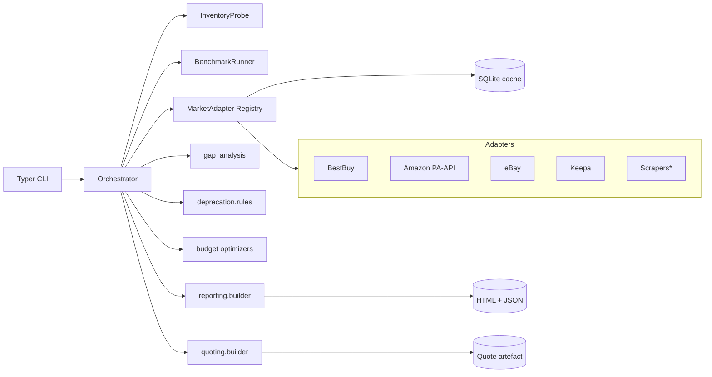

# PC Upgrade Advisor - Architecture

This document is the implementer-facing companion to `prompts/pc-upgrade-advisor-plan.md`.
It reflects what was **actually built** in Wave 1 (MVP) and marks deferred items.

## 1. Goals (recap)

- Inventory a PC, measure/estimate its performance, and compare it against a
  live market snapshot.
- Produce a human-readable report (HTML+JSON today; PDF in Wave 2).
- Recommend an upgrade plan that maximizes performance within a user-provided
  USD budget while honouring compatibility constraints.
- Generate a shareable quote (itemized + tax/shipping estimates + deal links).
- US-first. Windows-first. Privacy by default (no telemetry, local data).

## 2. Tech stack (as shipped in MVP)

| Area                 | Choice                                               | Notes |
| -------------------- | ---------------------------------------------------- | ----- |
| Language             | Python 3.12 / 3.14                                   | `ruff` + `mypy --strict`. |
| Config               | `pydantic-settings`                                  | `PCA_*` env vars + `.env`. |
| Logging              | `structlog`                                          | JSON logs by default. |
| Domain models        | Pydantic v2 (frozen)                                 | JSON schemas exported via `core.models`. |
| Local storage        | SQLite (via SQLAlchemy 2.0)                          | Cache + catalog. Postgres in Wave 3 for the web dashboard. |
| Hardware inventory   | `wmi` + `pynvml` behind `InventoryProbe`             | Lazy import; clean error when unavailable. |
| Benchmarking         | Built-in CPU worker + `fio`/`sysbench` shell-outs    | `BenchmarkRunner` does warm-up, median-of-N, CV check, env hash. |
| Market data          | `MarketAdapter` protocol + `AdapterRegistry`         | BestBuy Developer API + Amazon PA-API 5 stubs. Scrapers behind a kill-switch. |
| Optimizer            | Greedy heuristic + `PuLP` (CBC) ILP                  | Compatibility graph (socket, RAM type, PSU head-room). |
| Reporting            | Jinja2 templates -> HTML + JSON                       | PDF deferred to Wave 2 (WeasyPrint). |
| CLI                  | Typer + Rich                                         | 6 commands (see below). |
| Web dashboard        | FastAPI + HTMX + Alpine.js (Wave 3)                  | Not yet implemented. |
| Desktop shell        | Tauri wrapping web dashboard (Wave 4)                | Not yet implemented. |

## 3. High-level architecture



`*` Scrapers are gated by `PCA_ENABLE_SCRAPERS` and every adapter documents its
ToS position (see `docs/data-sources-tos.md`).

## 4. Domain model


## 5. Module layout (mirrors `src/pca/`)

- `core/` - shared Pydantic models, config, structured logging, exceptions.
- `inventory/` - `InventoryProbe` protocol, `WindowsInventoryProbe`, normalizers.
- `benchmarking/` - `BenchmarkRunner`, `BuiltinCpuWrapper`, fio/sysbench shells.
- `deprecation/` - YAML catalog + rules for sockets, RAM gen, OS, drivers.
- `reporting/` - Jinja2-driven HTML + JSON emitter (PDF in Wave 2).
- `market/` - adapter registry, BestBuy + Amazon adapters, file cache.
- `gap_analysis/` - catalog + benchmark blended scoring, workload weights,
  `weighted_overall_uplift`.
- `recommender/` - ranks candidates per component slot.
- `budget/` - `optimizer_greedy.py` + `optimizer_ilp.py`.
- `deals/` - deal ranker (price, reputation, shipping, warranty, freshness).
- `quoting/` - tax + shipping estimation, `build_quote`.
- `ui/cli/` - Typer app (`inventory`, `report`, `market`, `recommend`, `quote`, `bench`).

## 6. Algorithms

- **Bottleneck detection**: compares per-component catalog scores against
  workload weights; components whose normalized score is >1.5 stddev below the
  workload-weighted mean are flagged.
- **Performance scoring**: blended catalog-score and measured-benchmark value
  (`gap_analysis.normalize`). Benchmarks override catalog scores when an
  `env_hash` match exists.
- **Budget optimizer**:
  - *Greedy*: orders candidate upgrades by `perf_uplift_pct / price_usd`,
    respects socket / RAM-type / PSU / form-factor constraints.
  - *ILP*: `PuLP` + CBC binary MILP maximizing `sum(weight_k * uplift_k * x_k)`
    subject to `sum(price * x) <= budget` and compatibility pair-exclusions.
- **Deal ranker**: weighted sum of (price_percentile, reputation, shipping,
  warranty, freshness); weights configurable via `PCA_DEAL_WEIGHT_*` env vars.

## 7. CLI (Wave 1 UX)

```text
pca inventory    --stub tests/data/inventories/rig_mid.json --out snap.json
pca report       --stub ...                                 --out-dir out/
pca market       --market tests/data/market_snapshots/snapshot_normal.json
pca recommend    --budget 800 --market ... --stub ... [--strategy greedy|ilp]
pca quote        --budget 1200 --market ... --stub ... --zip 10001 --out-dir out/
pca bench        --quick
```

All commands exit non-zero on error. `--stub` bypasses the live probe so CI
runs cross-platform.

## 8. Test strategy (enforced)

- `tests/units/` - pure logic, no I/O (pytest-socket blocks network).
- `tests/functionals/` - end-to-end flows against KGRs in `tests/data/`.
- `tests/data/` - 3 reference rigs + 2 market snapshots + expected reports and
  quotes; all schema-validated via Pydantic in `test_kgr_fixtures.py`.
- Property-based tests (Hypothesis) for the budget optimizer invariants:
  never exceeds budget, monotonic uplift under relaxation, respects sockets.
- Contract tests for retailer adapters via `syrupy` snapshots of cassettes.

## 9. Deferred / open

- PDF rendering (WeasyPrint) - Wave 2.
- Live Linux/macOS inventory - Wave 2 / Wave 4.
- Web dashboard (FastAPI + HTMX) - Wave 3.
- Desktop shell (Tauri) - Wave 4.
- Plugin system for 3rd-party retailers.
- LLM "why this upgrade" explainer (opt-in, local models first).

## 10. Cross-references

- Product plan: `prompts/pc-upgrade-advisor-plan.md`.
- ADRs: `docs/adr/`.
- Data-source ToS stance: `docs/data-sources-tos.md`.
